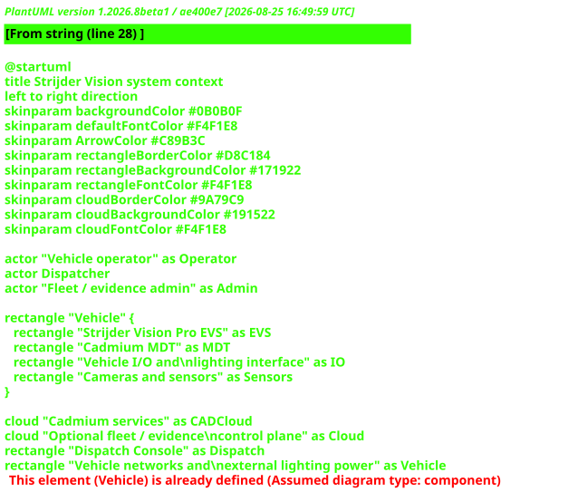

# Strijder Vision

Strijder Vision is a modular, offline-capable in-vehicle safety, evidence, control, and dispatch platform for police, fire, EMS, security, and specialized fleets.

The platform combines four concerns that are normally delivered as separate vehicle systems:

- a rugged in-vehicle computer and operator interface;
- continuous dash-camera and incident-evidence capture;
- vehicle diagnostics, emergency-light controls, sensing, and interlocks; and
- Strijder Cadmium, the computer-aided dispatch (CAD) subsystem.

This repository currently contains the original Strijder Vehicle Safety marketing site and the canonical engineering dossier for the wider Strijder Vision suite. The dossier captures recovered design decisions, reconstructed architecture, provisional engineering calculations, and unresolved choices.

> **Engineering status:** Concept and proof-of-concept documentation. Nothing in this repository is a certification, production release, installation authorization, or representation that the system is ready for use in a safety-critical vehicle.

## Product hierarchy

| Name | Scope |
|---|---|
| **Strijder** | Product brand and family. |
| **Strijder Vision** | In-vehicle computing, safety, evidence, diagnostics, and control platform. |
| **Strijder Vision Pro EVS** | Higher-compute Emergency Vehicle System configuration integrating dashcam, operator system, vehicle interfaces, and Cadmium. |
| **Strijder Cadmium CAD** | CAD software only: Dispatch Console plus in-vehicle MDT. Cadmium is not the name of the complete vehicle system. |

## Documentation map

- [Circuit base: five electrical drawing sheets, BOM and pin netlist](docs/engineering/circuit-base/README.md)
- [Engineering definition and functional schematics](docs/engineering/README.md)
- [Documentation index](docs/README.md)
- [Status, provenance, and limits](docs/STATUS_AND_PROVENANCE.md)
- [Product vision and scope](docs/product/VISION_AND_SCOPE.md)
- [Product history and brand](docs/product/HISTORY_AND_BRAND.md)
- [System requirements](docs/product/REQUIREMENTS.md)
- [Engineering roadmap](docs/product/ROADMAP.md)
- [System architecture](docs/architecture/SYSTEM_ARCHITECTURE.md)
- [Hardware architecture](docs/hardware/HARDWARE_ARCHITECTURE.md)
- [Power architecture and preliminary budget](docs/hardware/POWER_ARCHITECTURE.md)
- [Connector and harness specification](docs/hardware/CONNECTORS_AND_HARNESS.md)
- [Preliminary BOM](docs/hardware/BOM.md)
- [Cadmium software specification](docs/software/CADMIUM.md)
- [Evidence and security architecture](docs/software/EVIDENCE_AND_SECURITY.md)
- [Safety, compliance, and validation plan](docs/safety/SAFETY_COMPLIANCE_VALIDATION.md)
- [PlantUML diagrams](docs/diagrams/README.md)
- [Decision register and open questions](docs/DECISION_REGISTER.md)

## Architecture at a glance



The editable source for every diagram is committed as plain PlantUML, with a rendered SVG beside it. The SVGs were produced by the public PlantUML server; no local Java or Graphviz installation is required.

## Repository layout

```text
.
├── assets/                  Original site assets
├── docs/
│   ├── architecture/        System, data, control, and interface architecture
│   ├── diagrams/            Pure-text PlantUML sources
│   ├── hardware/            Compute, cameras, power, connectors, BOM, mechanics
│   ├── operations/          Installation and service concepts
│   ├── product/             Vision, boundaries, use cases, requirements
│   ├── safety/              Safety, compliance, threat, and validation planning
│   └── software/            Vision services, Cadmium, evidence, and security
├── index.html               Original static marketing page
├── main.js
└── styles.css
```

## Guiding design principles

1. **Vehicle-safe degradation.** CAD, networking, or cloud failure must not disable core recording or deterministic vehicle controls.
2. **Offline first.** Recording, local authentication, operator workflows, and queued synchronization continue without WAN connectivity.
3. **Evidence integrity.** Captured evidence is encrypted, journaled, hashed, attributable, and auditable from capture through export.
4. **Separation of responsibility.** High-level AI/vision compute does not directly energize emergency-light loads or defeat safety interlocks.
5. **Serviceable modularity.** Cameras, displays, compute, vehicle I/O, radios, and storage can be isolated and serviced by subsystem.
6. **No invented certainty.** Part numbers, ratings, regulatory conclusions, and requirements that were not finalized remain explicitly marked TBD.
