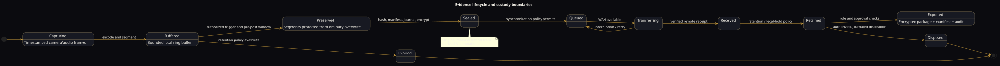

# Data and control flows

## Flow classes

Strijder traffic is divided into distinct classes so access, priority, retention, and failure behavior can be reasoned about separately.

| Class | Examples | Direction | Persistence |
|---|---|---|---|
| Media | Encoded camera/audio segments, thumbnails | Camera → Vision Core → evidence store/cloud | Ring buffer plus event retention |
| Evidence metadata | Hashes, manifests, event IDs, trigger source | Vision Core ↔ evidence administration | Durable/audited |
| Vehicle telemetry | Ignition, voltage, diagnostic values, input/output state | Vehicle/I/O → Vision Core/MDT/cloud | Policy controlled |
| Control requests | Named lighting mode, camera selection, event mark | MDT/physical selector → I/O or Vision Core | Journaled when material |
| CAD operational | Calls, units, statuses, messages, route | Dispatch ↔ MDT | Durable with offline queue |
| Device management | Policy, configuration, software, certificates | Admin → vehicle | Signed/versioned |
| Health | Service, storage, camera, radio, thermal faults | Vehicle → operator/admin | Time-series/event based |

## Camera-to-evidence flow

1. A camera link is discovered and assigned a stable channel identity.
2. Frames receive a monotonic capture timestamp and available wall-clock provenance.
3. The recorder encodes and segments the stream.
4. Ordinary segments enter the bounded ring buffer.
5. A manual or configured trigger opens an evidence event.
6. Pre-event and post-event segments are referenced or copied into protected storage according to implementation.
7. A manifest binds segment hashes, channel, device, timing, trigger, and permitted context.
8. The journal records preservation and any subsequent access/export.
9. The synchronization agent transfers content under policy and resumes after interruption.

## CAD flow

1. Dispatch creates or updates a call.
2. The Cadmium service persists the update and assigns a monotonically ordered revision/event identifier.
3. The assigned MDT receives the call over the current transport or later through a durable queue.
4. The MDT stores the assignment locally before acknowledging it.
5. Unit status changes are written locally and transmitted idempotently.
6. Dispatch resolves updates using server authority and explicit conflict rules rather than wall-clock last-write-wins alone.
7. If configured, the call ID may be associated with an evidence event, but CAD does not rewrite evidence.

## Warning-light control flow

1. A physical selector or authorized UI sends a named-mode request.
2. The I/O controller verifies message authenticity, freshness, and source authorization.
3. The controller evaluates local vehicle inputs and interlock rules.
4. The requested named mode resolves to a fixed output pattern in signed/approved controller configuration.
5. The controller drives low-level control outputs to an independently powered lighting module.
6. Feedback is compared with commanded state; disagreement raises a fault.
7. The transition is journaled with source and reason.

No cloud or computer-vision result directly energizes an emergency-light circuit.

## Diagnostics flow

- Vehicle network data is ingested through a protected gateway.
- Raw identifiers are normalized into typed telemetry with source, timestamp, validity, and units.
- Unsupported or ambiguous data remains unknown rather than being guessed.
- Read-only access is the default.
- Alerts are generated by deterministic policy thresholds.
- Remote views receive only data authorized by fleet policy.

## Time model

Evidence and operational records should carry both:

- monotonic device time for ordering and duration; and
- synchronized wall-clock time with source and uncertainty.

Clock corrections must never silently reorder already-committed journal entries.

## Identifier model

Globally unique, immutable identifiers are required for:

- device, vehicle, fleet/agency, operator session;
- camera channel and recording segment;
- evidence event and export package;
- CAD call, unit, assignment, message, and status event;
- policy/configuration version;
- software release and hardware assembly.

Human-readable labels may change without changing these identities.
