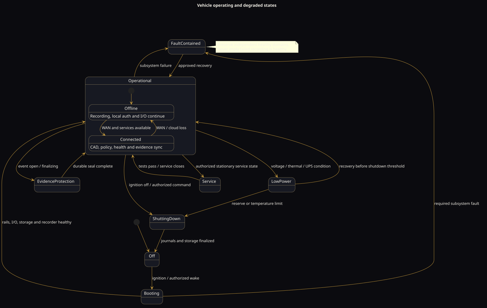

# Modes and degraded operation

## Vehicle operating modes

| Mode | Recording | Operator UI | CAD | Vehicle I/O | WAN |
|---|---|---|---|---|---|
| Off | Finalized/stopped | Off | Off | Safe defaults/low-power monitor | Off |
| Booting | Starts as early as safe | Progress/health | Restoring | Independent boot/defaults | Optional |
| Operational offline | Active | Active | Cached/queued | Active | Unavailable |
| Operational connected | Active | Active | Live/synchronized | Active | Available |
| Evidence protection | Active; event pinned | Active | Active or degraded | Active | Optional |
| Low power | Priority channels per policy | Warning/reduced | Queued | Load shedding | Reduced/off |
| Service | Policy-defined | Diagnostic | Normally unavailable | Outputs inhibited/test-controlled | Optional |
| Fault containment | Healthy channels continue | Clear fault | Independent | Safe local behavior | Independent |

## Degraded-operation matrix

| Failure | Continues | Lost or reduced | Required response |
|---|---|---|---|
| WAN/cellular | Recording, local auth, I/O, cached MDT | Remote live view, immediate sync | Queue, display nonblocking status, resume idempotently |
| Cloud service | Same as WAN loss | Remote admin/evidence intake | Backoff and retain locally |
| Cadmium service | Recording, I/O, local vehicle UI | New dispatch traffic | Preserve current assignment, raise status |
| Windows display | Vision recording, I/O | Operator CAD/display | Log, allow controlled restart |
| Vision Core | Independent I/O behavior | Recording/vision/evidence services | I/O safe state, explicit operator fault |
| I/O controller | Recording/CAD where safe | Integrated lighting/control | External hardware defaults, prominent fault |
| One camera | Other channels | Failed view | Mark channel unavailable; do not corrupt other evidence |
| GPS/GNSS | Recording, I/O, most CAD | Live position/routing precision | Mark location invalid; retain last fix with age |
| Storage nearing full | Current recording under policy | Retention headroom | Alert, protect incidents, deterministic eviction |
| Storage failed | I/O/CAD | Evidence recording | Immediate critical fault; no false recording indication |
| Primary vehicle power | UPS-supported functions | Nonessential loads | Enter hold-up policy, finalize evidence, controlled shutdown |
| Overtemperature | Safety controller, prioritized functions | AI/preview/secondary encoding | Throttle or shed in documented order |

## Load-shed order

The following is a proposed order and must be validated against actual hardware:

1. nonessential remote transfers and bulk evidence upload;
2. optional AI inference;
3. nonessential live previews and auxiliary display;
4. noncritical radios/peripherals where operationally acceptable;
5. secondary recording profiles/channels according to policy;
6. controlled evidence finalization and shutdown.

The independent I/O controller remains powered long enough to establish safe output state. Emergency warning equipment with independent vehicle power is governed by its own safety behavior.

## Boot and shutdown ordering

### Boot

1. Power module validates input and establishes protected rails.
2. I/O controller boots into safe defaults and begins watchdog supervision.
3. Vision Core boots and starts health, time, storage, and recorder services.
4. Windows/operator domain starts and authenticates to local services.
5. Network services synchronize in the background.

### Shutdown

1. Power module/I/O reports ignition-off or power-loss condition.
2. New nonessential work stops.
3. Recorder closes current segments and evidence journal entries.
4. Databases and queues commit.
5. Windows and Vision Core shut down within the UPS budget.
6. I/O controller establishes the required parked/off state.

Hard power removal during any step is a required test case; the system must recover without claiming nonexistent evidence or corrupting unrelated retained events.
