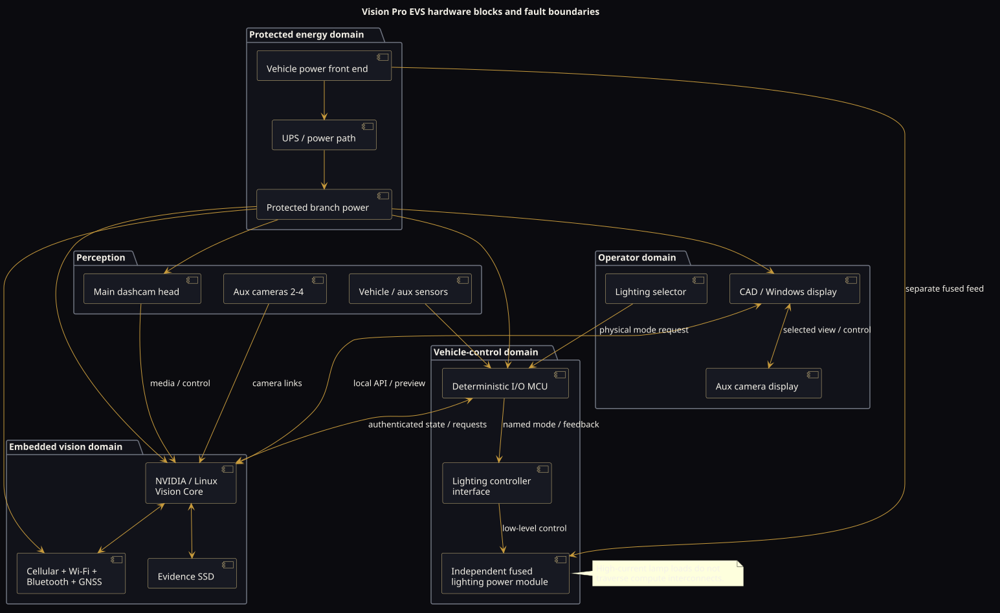
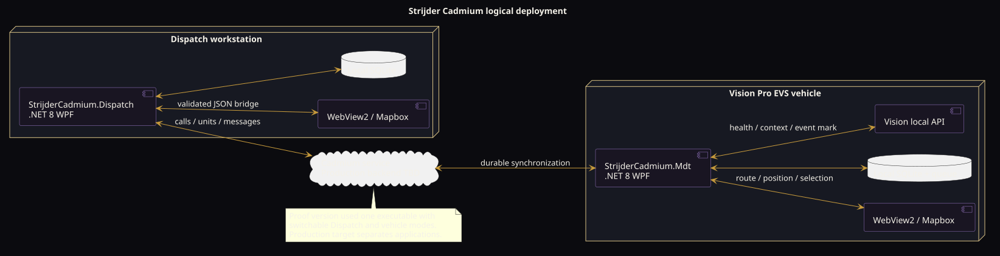

# PlantUML diagram gallery

All diagram sources are plain PlantUML. Committed SVGs were rendered through the public PlantUML server. Edit the `.puml` source, regenerate its matching SVG, and do not commit generated Graphviz scripts or require a local Java installation.

## Product family

[Source](product-family.puml)


## System context

[Source](system-context.puml)


## Hardware blocks

[Source](hardware-blocks.puml)



## Power distribution

[Source](power-distribution.puml)


## Connector topology

[Source](connector-topology.puml)


## Cadmium deployment

[Source](cadmium-deployment.puml)



## Evidence lifecycle

[Source](evidence-lifecycle.puml)


## Degraded operation

[Source](degraded-operation.puml)


## Rendering contract

The Markdown image URL pattern is:

```text
https://www.plantuml.com/plantuml/proxy?cache=no&fmt=svg&src=https://raw.githubusercontent.com/Gitbub0816/strijder/main/docs/diagrams/<diagram>.puml
```

This keeps the text source canonical and allows GitHub or a browser to request the rendered SVG directly from PlantUML.
