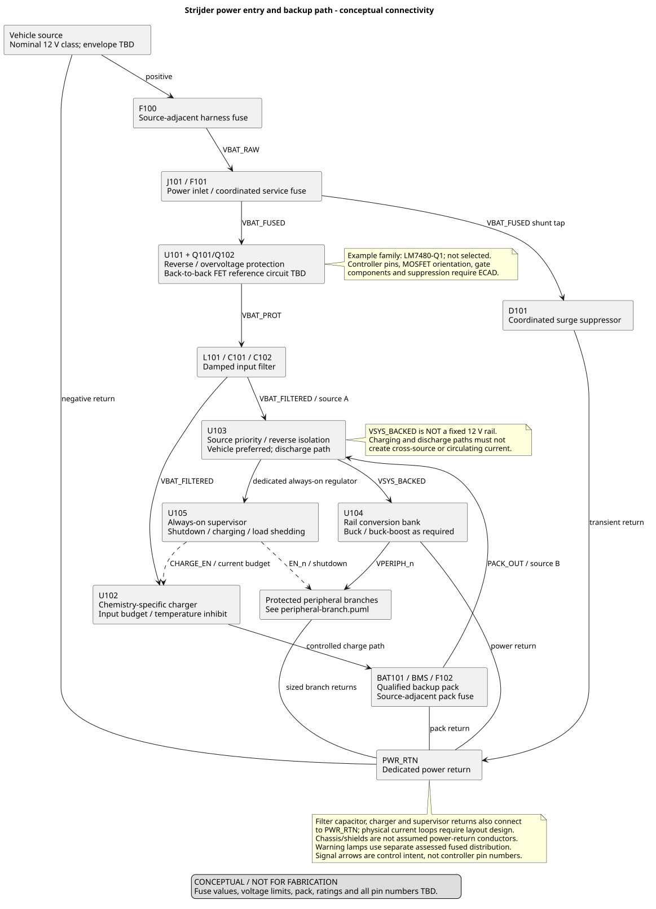
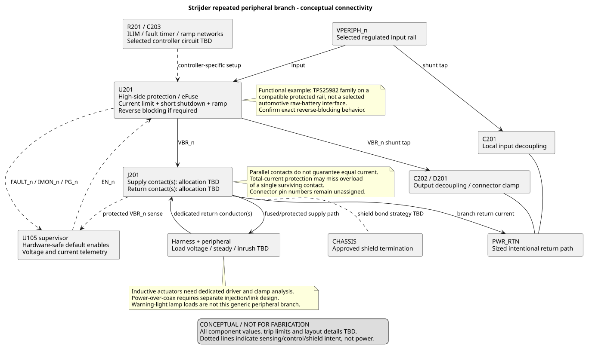
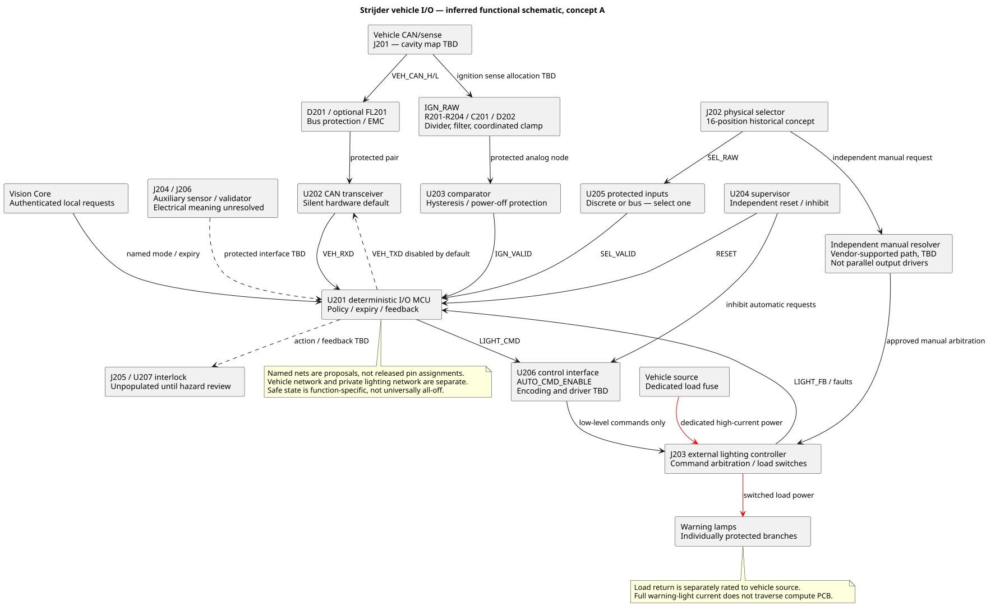
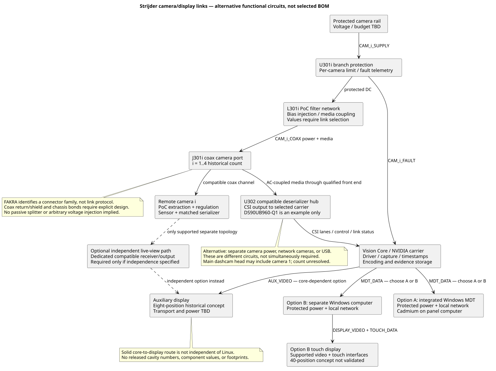

# Functional electrical schematic sheets

Revision A — inferred engineering connectivity, **not fabrication-ready ECAD**. Component values, actual IC pins, connector cavities and footprints remain subject to selection and review. Arrows identify functional paths, not a manufacturing netlist.

| Sheet | Editable source | Rendered drawing |
|---|---|---|
| Protected vehicle input, backup supply and rails | [PlantUML](power-front-end.puml) | [SVG](rendered/power-front-end.svg) |
| Protected peripheral branch and return | [PlantUML](peripheral-branch.puml) | [SVG](rendered/peripheral-branch.svg) |
| Vehicle sense, CAN and lighting control | [PlantUML](vehicle-io.puml) | [SVG](rendered/vehicle-io.svg) |
| Camera transport and operator displays | [PlantUML](camera-display-links.puml) | [SVG](rendered/camera-display-links.svg) |

SVG files are committed vector drawings, viewable without PlantUML software. Open them in a browser to zoom or print to PDF.

## Drawings

## Regeneration

From the repository root, run `node docs/engineering/render-schematics.mjs`. Node and curl are required; local Java and Graphviz are not used. The script encodes the plain-text sources and requests SVG images from the public PlantUML server over HTTPS. **This transmits diagram contents to a third party**; do not add secrets or confidential installation details without approving that disclosure. Committed renders can be viewed offline.

See the [engineering index](../README.md) for the interpretation, calculations, evidence and release limits behind these sheets.
