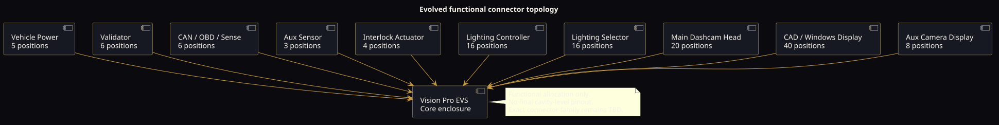

# Connectors and harness

## Purpose

Two connector schemes were discussed at different stages. This document preserves both and defines the work required to produce a final interface-control document (ICD).

## Generation A: early panel concept

The early Strijder panel defined eleven external connector positions:

| Label | Family/form | Role |
|---|---|---|
| `DT6_Power` | 6-position DEUTSCH DT | Main vehicle power interface. |
| `DTM12_Data` | 12-position DEUTSCH DTM | General vehicle/peripheral data. |
| `HDP20_MainHead` | 20-position DEUTSCH HDP20 | Main dashcam/operator head. |
| `SMA_LTE` | SMA | External LTE antenna. |
| `DTM6_Interlock` | 6-position DEUTSCH DTM | Interlock sensing/control. |
| `DTM4_Val1` | 4-position DEUTSCH DTM | Validator/valve channel 1; exact semantic name requires confirmation. |
| `DTM4_Val2` | 4-position DEUTSCH DTM | Validator/valve channel 2; exact semantic name requires confirmation. |
| `FAKRA_Cam1` | FAKRA/mini-FAKRA concept | Camera channel 1. |
| `FAKRA_Cam2` | FAKRA/mini-FAKRA concept | Camera channel 2. |
| `FAKRA_Cam3` | FAKRA/mini-FAKRA concept | Camera channel 3. |
| `FAKRA_Cam4` | FAKRA/mini-FAKRA concept | Camera channel 4. |

No complete pinout was recovered. The `Val` label is ambiguous in retained context and must not be silently interpreted as either “validator” or “valve” in a released drawing.

## Generation B: expanded functional connector family

The later design split responsibilities more explicitly:

| Functional connector | Positions | Primary role |
|---|---:|---|
| Vehicle Power | 5 | Protected main input, return, ignition/wake and/or health. Exact allocation TBD. |
| Validator | 6 | Validator interface; signaling and auxiliary power TBD. |
| CAN/OBD/Sense | 6 | Protected vehicle bus/sense interface. |
| Auxiliary Sensor | 3 | Power, return, and sensor signal as a likely minimum; exact allocation TBD. |
| Interlock Actuator | 4 | Protected actuator/control and feedback. |
| Lighting Controller | 16 | Control, communication, feedback, and controller electronics power. |
| Lighting Selector | 16 | Physical selector inputs, indicators, communications, and power. |
| Main Dashcam Head | 20 | Media/control/power/status for main head. |
| CAD/Windows Display | 40 | Display/compute power, data, control, and service signals. |
| Auxiliary Camera Display | 8 | Display power, video/data, control, and status. |

The discussed mechanical “Style A” concept was rectangular and direct-to-board with:

- 2.00 mm pitch;
- 15.0 mm board-to-panel spacing;
- 1.5 mm panel thickness;
- 2.0 mm shell protrusion.

The exact manufacturer, sealing system, contact geometry, and current rating were not retained. These dimensions alone are not sufficient to select or fabricate a production connector.

## Current recommended relationship

Generation B is the functional baseline because it exposes the complete suite architecture. Generation A remains a viable rugged external-connector reference and contains actual named DEUTSCH/FAKRA families. A final design may use Generation B's functional separation implemented with appropriately sized DEUTSCH, automotive high-speed, and RF connectors rather than one uniform 2.00 mm family.

## Preliminary power-contact allocation

The current working allocation is documented in [Power architecture](POWER_ARCHITECTURE.md): 11 positive contacts and 11 matching returns across the nine powered peripheral groups, with parallel pairs for the main head and CAD/Windows display. This is not a cavity-level pinout.

## Pin-class rules

Every final contact must be assigned exactly one class:

- unswitched battery input;
- ignition/wake sense;
- protected switched supply;
- regulated peripheral supply;
- power return;
- signal reference;
- chassis/shield/drain;
- differential communications pair;
- high-speed media pair/coax;
- analog sensor input;
- protected digital input;
- low-side/high-side control output;
- feedback/fault input;
- reserved/do-not-connect.

Power return, signal reference, and chassis/shield are not interchangeable labels.

## Harness design rules

- Key connectors so a peripheral cannot be inserted into a damaging port.
- Use connector position assurance and strain relief appropriate to vibration.
- Avoid sharing a small return contact between unrelated high-current branches.
- Pair each supply with an intentional return path and document shield termination.
- Protect every off-board conductor against its credible shorts and transients.
- Keep high-speed camera/RF routing separate from noisy switched-lighting conductors.
- Twist and terminate differential vehicle-network pairs to their physical-layer requirements.
- Place branch protection near the energy source, not only near the load.
- Label both ends with assembly, connector, and cavity identifiers.
- Make field-replaceable harnesses impossible to assemble ambiguously.
- Do not route full warning-light current through the compute enclosure.

## Interface-control drawing required fields

For every connector:

1. manufacturer and full part number;
2. mating connector, backshell, seals, wedges/locks, and key code;
3. cavity number and view orientation;
4. signal name, direction, electrical class, normal range, absolute maximum;
5. contact part number and plating;
6. wire type, gauge, color, twist/shield, maximum length;
7. fuse/protection source;
8. grounding/shield termination;
9. unused-contact treatment;
10. mating cycles, ingress, temperature, vibration, and service tooling;
11. fault behavior for open, short-to-ground, short-to-battery, and cross-pin contact.

## Open connector decisions

- Whether Vehicle Power remains a DT6 or uses the later five-position format.
- Whether the 2.00 mm direct-to-board concept is rugged/sealed enough for each location.
- Whether camera links are FAKRA, mini-FAKRA, or another automotive high-speed system.
- Whether cameras use PoC and how each channel is current limited.
- Whether the main head and display need parallel power contacts or a separate higher-current connector.
- Whether the 40-position CAD display connector mixes high-speed video, USB/Ethernet, and power or uses separate interfaces.
- Whether lighting selector/controller interfaces use discrete lines, CAN/LIN, or a hybrid.
