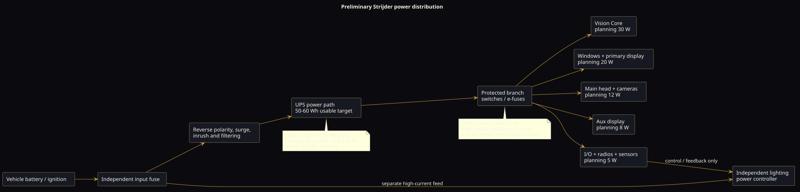

# Power architecture and preliminary budget

## Known planning anchors

- Nominal vehicle system: 12–14 V class.
- Initial continuous design load: approximately **75 W**.
- Desired backup interval discussed: **20 minutes**.
- Ideal energy for 75 W over 20 minutes: **25 Wh**.
- Prototype target: approximately **50–60 Wh usable**.
- Larger planning envelope considered: **75–100 Wh nominal**.
- Example pack: **12.8 V × 6 Ah ≈ 76.8 Wh** LiFePO4.

The pack chemistry and values above are planning history, not a released battery design.

## Current calculation

For a 75 W load:

| Rail voltage | Total current | Current/contact with two positive and two return contacts |
|---:|---:|---:|
| 14.0 V | 5.36 A | 2.68 A |
| 13.8 V | 5.43 A | 2.72 A |
| 12.8 V | 5.86 A | 2.93 A |
| 12.0 V | 6.25 A | 3.13 A |
| 9.0 V planning dip | 8.33 A | 4.17 A |

The 9 V row is a provisional engineering case, not a finalized minimum operating voltage. The actual current must include converter efficiency, inrush, battery charging, heaters, display brightness, radio transmit peaks, and other transient loads.

## Preliminary peripheral power-pin allocation

“Power-path contacts” includes both positive supplies and matching returns.

| Peripheral branch | Positive | Return | Total contacts | Status |
|---|---:|---:|---:|---|
| Validator | 1 | 1 | 2 | Provisional |
| CAN/OBD/Sense module | 1 | 1 | 2 | Provisional; omit pair if sense-only |
| Auxiliary sensor | 1 | 1 | 2 | Provisional |
| Interlock actuator/control | 1 | 1 | 2 | Provisional |
| Lighting controller electronics | 1 | 1 | 2 | Provisional; not lamp current |
| Lighting selector | 1 | 1 | 2 | Provisional |
| Main dashcam/compute head | 2 | 2 | 4 | Provisional parallel contacts |
| CAD/Windows display | 2 | 2 | 4 | Provisional parallel contacts |
| Auxiliary-camera display | 1 | 1 | 2 | Provisional |
| **Baseline total** | **11** | **11** | **22** | Current working allocation |

Variations:

- If CAN/OBD/Sense is unpowered or sense-only: **10 positive + 10 return = 20**.
- If four cameras use power over coax: no additional general-purpose power contacts are allocated.
- If four cameras require separate power: add **4 positive + 4 return**, for **30 total**.

## Highest planned continuous current per contact

If one contact carried the entire 75 W rail, it would carry 6.25 A at 12 V and more at lower voltage. That is not the preferred design.

With two well-matched positive contacts and two returns, the present worst-case planning value is approximately **4.17 A per contact at 9 V**, before losses. A preliminary design target is therefore:

- no more than about **4.2 A continuous per paralleled main-feed contact** at the current load assumption;
- contacts, wiring, traces, and terminations qualified for at least **5 A continuous** under the actual bundled-wire and enclosure thermal conditions;
- separate allowance for inrush and transient peaks.

Parallel paths must use the same contact type, wire gauge/length, and symmetric copper geometry. Do not assume ideal sharing. Each branch requires fault analysis so one open contact does not overload the survivor indefinitely.

## Connector rating references

- TE Connectivity lists DEUTSCH DTM size-20 contacts at **7.5 A** continuous.
- TE Connectivity lists DEUTSCH DT size-16 contacts at **13 A** continuous.
- HDP20 current depends on installed contact size; published values include 7.5 A, 13 A, 25 A, and 60 A.

Manufacturer maximum ratings are not automatic system design currents. Harness bundling, conductor gauge, ambient temperature, PCB copper, connector cavity population, contact resistance, mating cycles, contamination, and housing temperature require derating.

References:

- [TE Connectivity — DEUTSCH DTM](https://www.te.com/en/products/connectors/automotive-connectors/intersection/deutsch-dtm-connectors.html)
- [TE Connectivity — DEUTSCH DT](https://www.te.com/en/products/connectors/automotive-connectors/intersection/deutsch-dt-series-connectors.html)
- [TE Connectivity — HD30/HDP20 catalog](https://www.te.com/content/dam/te-com/documents/industrial-and-commercial-transportation/global/ict-hd30-hdp20-cat-a4-en.pdf)

## Provisional load allocation

The following decomposition exists only to make the 75 W budget testable. It is not recovered as an approved BOM.

| Load group | Planning allocation | Notes |
|---|---:|---|
| Vision Core compute and carrier | 30 W | Must include selected module operating mode and conversion losses. |
| Windows/CAD compute and primary display | 20 W | Highly dependent on display brightness and compute placement. |
| Main head plus up to four camera links | 12 W | Camera heaters or high-power IR are excluded. |
| Auxiliary-camera display | 8 W | Can be shed in low-power mode. |
| I/O, selector, sensing, GNSS/radio overhead | 5 W | Radio transmit peaks require separate measurement. |
| **Total** | **75 W** | Planning decomposition only. |

## UPS sizing

Ideal energy:

```text
75 W × (20 / 60 h) = 25 Wh
```

Real usable energy must account for:

- converter efficiency;
- cold-temperature capacity;
- aging and end-of-life reserve;
- battery-management cutoff;
- peak load and inrush;
- safe shutdown margin;
- cell imbalance and manufacturing tolerance.

A 12.8 V, 6 Ah pack stores approximately 76.8 Wh nominal. If only 50–60 Wh is treated as operationally usable, it provides substantial margin over the ideal 25 Wh calculation, subject to actual temperature, load, BMS, and aging tests.

## Power-tree proposal



1. Vehicle battery and ignition enter through independently fused harness conductors.
2. Front-end protection handles polarity, surges/transients, filtering, and controlled inrush.
3. The UPS/power-path controller selects vehicle or backup energy without resetting protected loads.
4. Protected branch switches feed Vision Core, Windows/display, cameras, radios, and low-power I/O.
5. The warning-light power controller has its own fused high-current vehicle feed.
6. Telemetry reports total/branch current, voltage, temperature, source, and shutdown reserve.

## Required tests before pinout release

- measure steady, boot, encode, inference, radio-transmit, display-maximum, and shutdown currents;
- test at minimum/maximum operating voltage and temperature;
- test crank/dropout recovery and repeated ignition cycles;
- characterize inrush and connector hot-plug behavior;
- validate current sharing in every paralleled contact pair;
- test single-open-contact and high-resistance-contact faults;
- verify fuse coordination and wire/trace temperature rise;
- validate UPS run time at beginning and end of life;
- test hard power loss during recording and evidence finalization;
- ensure lighting-load transients do not reset compute or corrupt storage.
