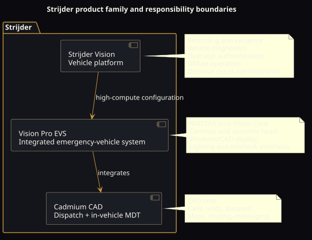

# Vision and scope

## Product vision

Strijder Vision is intended to replace a fragmented stack of unrelated dashcams, mobile computers, vehicle diagnostic devices, emergency-light control panels, and dispatch terminals with a coherent in-vehicle platform.

The product is not simply a camera with a cloud portal. Its defining idea is that recording, operator context, vehicle state, dispatch information, and permitted vehicle controls share a trusted local architecture while remaining independently degradable.

## Intended users

### Primary users

- law-enforcement officers and supervisors;
- fire and EMS operators;
- public-safety dispatchers;
- private security and specialized-fleet operators;
- fleet administrators, evidence custodians, installers, and service technicians.

### Operational environments

- patrol and emergency-response vehicles;
- security and command vehicles;
- mixed-connectivity areas where WAN service is intermittent;
- stationary and mobile operation;
- high-vibration, temperature-variable automotive environments.

## Product family

### Strijder Vision

The base in-vehicle platform provides:

- continuous dash-camera recording;
- local evidence buffering and incident preservation;
- vehicle position, mapping, and optional live tracking;
- vehicle diagnostics and configurable alerts;
- local operator authentication and policy enforcement;
- communications and queued cloud synchronization;
- optional rear, side, or auxiliary cameras;
- service and health telemetry.

### Strijder Vision Pro EVS

Vision Pro EVS is the integrated, higher-compute Emergency Vehicle System configuration. It adds or consolidates:

- NVIDIA-class embedded processing under Linux;
- computer-vision and evidence-processing capacity;
- the main dashcam/operator head;
- a Windows/CAD display domain;
- auxiliary-camera display support;
- lighting controller and selector integration;
- vehicle CAN/OBD/sense inputs;
- auxiliary sensors and interlock actuators;
- Cadmium MDT integration.

The Linux processing domain is intentionally background infrastructure. Operators interact through purpose-built vehicle and CAD interfaces rather than a general Linux desktop.

### Strijder Cadmium CAD

Cadmium is only the computer-aided/assisted dispatch product. It provides:

- a Dispatch Console for calls and units;
- an in-vehicle MDT for assignments, statuses, mapping, routing, and messaging;
- a shared domain model and map implementation;
- integration with Vision Pro EVS context and operator hardware.

Cadmium must remain replaceable and independently degradable. A Cadmium crash must not stop core evidence recording or deterministic vehicle controls.

## In scope

| Capability | Scope |
|---|---|
| Recording | Continuous local capture, policy-based ring buffer, incident preservation, metadata association. |
| Evidence | Local encryption, integrity journaling, auditability, controlled export, queued synchronization. |
| Operator | Rugged display, local authentication, status and health, camera views, Cadmium MDT. |
| Vehicle | Power conditioning, ignition/wake behavior, diagnostics, approved read-only or controlled CAN/OBD interaction. |
| Warning systems | Control-interface integration with deterministic safety controller and interlocks; high-current loads remain off the compute interconnect. |
| Dispatch | Calls, units, statuses, mapping, routing, messages, dispatch-to-MDT workflow. |
| Connectivity | Cellular, Wi-Fi, Bluetooth, GPS/GNSS, optional cloud services, offline queues. |
| Administration | Signed fleet profiles, policy, device health, evidence authorization, audit events. |
| Serviceability | Modular harnessing, diagnostics, replaceable cameras/displays/compute/storage where practical. |

## Explicitly outside the current baseline

- Sights or pedestrian accessibility navigation;
- autonomous driving or driver-assistance control;
- unapproved writing to safety-critical vehicle networks;
- direct high-current lightbar power switching through the main compute board;
- automatic enforcement or biometric identification claims;
- final 911/PSAP certification or integration;
- final body-camera product scope;
- cloud-dependent recording or authentication;
- a final production camera, compute, radio, display, battery, or connector SKU.

## Differentiating principles

### Local continuity

WAN loss should affect remote visibility and synchronization, not recording, authentication, operator access, basic vehicle control, or already-downloaded Cadmium assignments.

### Context-rich evidence

Where policy permits, an incident package can associate footage with time, location, operator, unit, vehicle state, dispatch call, trigger reason, camera channel, and an integrity record.

### Controlled integration

The system may unify operator experience without collapsing all safety domains into one failure domain. Linux compute, Windows CAD, vehicle I/O, camera capture, and cloud services are separate components with explicit interfaces.

### Fleet policy rather than consumer settings

Configuration is delivered as signed fleet/agency policy. Operators receive only those controls appropriate to their role and current vehicle state.
